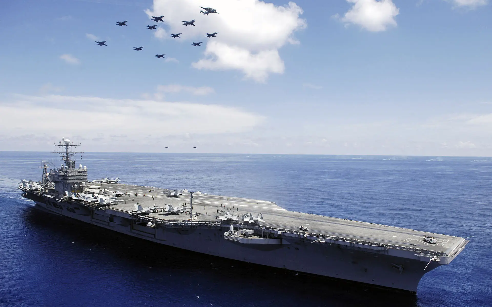

# web-aircraft-carrier

React Frontend + NodeJS Server + Docker Deployment all in one project.

> This is a template project which means that it shouldn't be used without any changes.



## Features

- One project for EVERYTHING you needed
- TypeScript supported
- Tool Scripts for development and deployment

## Documentation

See more documentations in [here](./docs/main.md).

## Quick Start

1. Enter your project directory.

```bash
cd MY_DIR
```

2. Create Project

For FullStack Project:

```bash
curl -o- https://raw.githubusercontent.com/yuri2peter/web-aircraft-carrier/main/scripts/create-project/fullstack.sh | bash
```

For Frontend Project:

```bash
curl -o- https://raw.githubusercontent.com/yuri2peter/web-aircraft-carrier/main/scripts/create-project/frontend.sh | bash
```

For NodeServer Project:

```bash
curl -o- https://raw.githubusercontent.com/yuri2peter/web-aircraft-carrier/main/scripts/create-project/server.sh | bash
```

## Development

Enter scripts directory:

```bash
cd scripts
```

For frontend development:

```bash
sh dev-frontend.sh
```

For backend development:

```bash
sh dev-server.sh
```

Compile frontend files and copy them into server:

```bash
sh build-frontend.sh
```

Serve in production mode:

```bash
sh start.sh
```

## Publish & Deployment

- See `server/docker`
- Create a protable node app with [node-app-protable](https://github.com/yuri2peter/node-app-protable)
- Create a protable Electron app with [electron-app-template](https://github.com/yuri2peter/electron-app-template)
